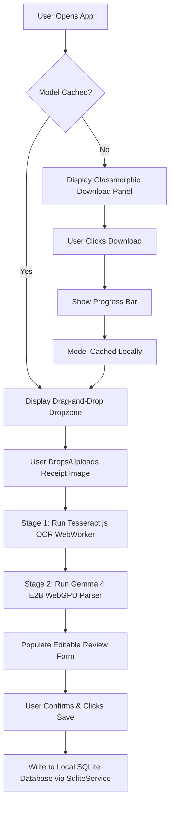

# Specification: On-Device AI Receipt Analyzer

**Status**: triage
**Feature Slug**: `receipt-analyzer`
**Type**: Spec / PRD

---

## 1. Product Objective

Provide a premium, 100% private, and offline-first AI receipt scanner that allows users to upload a photo of a receipt and automatically extracts key transaction details to populate the database entry form. This eliminates manual typing, ensures high data accuracy, and operates entirely inside the user's browser sandbox with zero external API calls.

---

## 2. User Experience Flow (Deferred to Phase 2)



### Key UI/UX Phases (Deferred to Phase 2)

1. **The Download Guard**:
   - If the `gemma-4-E2B-it.litertlm` model weights (~2.4GB) are not yet stored in the browser's Cache Storage, show a premium card explaining the Web AI benefits.
   - Provide a "Download Local AI Engine" button.
   - When clicked, display a smooth, glassmorphic progress tracker showing the download percentage.
2. **The Dropzone**:
   - Once cached, display a responsive, hover-animated drag-and-drop file uploader area.
   - Accept images (`image/png`, `image/jpeg`, `image/webp`).
3. **The Active Analyzer State**:
   - **Stage 1 (OCR)**: Visual "Scanning text..." spinner with micro-animations.
   - **Stage 2 (Local LLM)**: Visual "Gemma is thinking..." loading state.
4. **Human-in-the-Loop Review Form**:
   - Auto-populate form input fields for `merchantName`, `amount`, `transactionDate`, and `category` using the parsed JSON.
   - Highlight populated fields to invite the user to review, edit, and click "Confirm and Save" to persist the transaction to the SQLite WASM database.

---

## 3. Technical Architecture & File Layout

We conform to **Option 3 (Namespaced Core Pattern)**. All backend AI logic is separated from the UI presentation layer:

```text
src/app/
├── core/
├── consts/
│   │   └── window.const.ts             # DI Tokens for safe SSR Window/Cache injection
│   └── services/
│       └── ai/
│           ├── ai-model-cache.service.ts # Model downloading, sharding, and caching
│           └── receipt-analyzer.service.ts # Tesseract OCR + LiteRT-LM Gemma 4 execution
├── features/
│   └── (expenses / dashboard UI components binding to services)
└── assets/
    └── FileProxyCache.min.js           # Vendored copy of Jason Mayes' proxy-cache utility
```

### ES Module Integration

To prevent global namespace pollution and ensure safe pre-rendering builds during server-side builds (SSR), `FileProxyCache.min.js` is imported **strictly as a scoped ES Module** directly inside services. It must **not** be registered inside legacy global `"scripts"` arrays in `angular.json`.

---

## 4. Coding Standards & Code Style Constraints

To ensure maximum compatibility and strict coding quality, the following rules **MUST be followed during implementation without exception**:

1. **No Dangling `if` Statements**:
   - Every `if` block **must** be wrapped in curly braces `{}` even if its body contains only a single statement.
   - _Anti-pattern_: `if (condition) return;`
   - _Correct_:

     ```typescript
     if (condition) {
       return;
     }
     ```

2. **Strict Increment Syntax**:
   - Always write `x = x + 1;` for increments. Do **not** use the `x++` or `++x` operators.
   - _Anti-pattern_: `count++;`
   - _Correct_: `count = count + 1;`

3. **SSR Safety**:
   - Never access `window` or `caches` directly. Always inject the `WINDOW` and `CACHE_STORAGE` Dependency Injection (DI) tokens defined in `src/app/core/consts/window.const.ts`.

4. **Unit Testing Framework**:
   - To support lightweight, ultra-fast headless testing of core state managers, JSON utilities, and parsing math without browser orchestration overhead, the project standardizes on **Vitest** paired with **jsdom** as our primary unit test runner, executed via `npm run test:file <name>`. All core utilities and parsing state services must maintain 100% test coverage under Vitest.

---

## 5. Implementation Phase Requirements

### Part 1: Caching Layer (`AiModelCacheService`)

- Fetch the model file in the background or stream via Jason Mayes' local `FileProxyCache.loadFromURL` (imported as an ES Module).
- Regularly parse the status string to update the public, read-only Signals:
  - `status()`: `'not-downloaded' | 'downloading' | 'cached'`
  - `progress()`: `number` (0 - 100)

### Part 2: Parsing Layer (`ReceiptAnalyzerService`)

- **Tesseract OCR**: Execute character extraction and clean up formatting using the extracted multilingual utility.
- **LiteRT-LM Init**: Initialize the engine using the offline `blob:` URL provided by the caching layer.
- **System Prompt**: Feed Gemma 4 E2B a precise, low-temperature prompt requesting a structured JSON schema:

  ```json
  {
    "merchantName": "string",
    "amount": number,
    "transactionDate": "YYYY-MM-DD",
    "category": "string"
  }
  ```

---

## 6. Acceptance Criteria

- [ ] App compiles with `ng build` with zero TypeScript or dependency-injection errors.
- [ ] Safe for SSR: Pre-rendering does not crash during server builds.
- [ ] Model downloads with live progress signals, caches successfully, and bypasses download instantly on subsequent runs.
- [ ] Receipt image scanning accurately extracts the correct merchant, total, date, and category, and populates the human-in-the-loop validation form.
- [ ] Unit Test Safety: All newly added state helper creators, JSON sanitizers, progress calculators, and OCR utilities compile and pass successfully under the Vitest test runner.

---

## 7. Phased Implementation Plan

To maintain a clean separation of concerns and leverage collaborative design tools, the development is divided into two distinct phases:

### Phase 1: Core AI & Caching Infrastructure (Active)

Focus entirely on the backend engine and hardware-level integrations. No UI components or dashboard views are altered.

- Create dependency injection tokens (`src/app/core/consts/window.const.ts`).
- Vendor, type, and configure `FileProxyCache.min.js` as an ES Module import.
- Establish **Vitest + jsdom** headless unit testing configurations.
- Implement `AiModelCacheService` to handle sharded caching and signal updates.
- Implement `ReceiptAnalyzerService` to orchestrate Tesseract OCR and LiteRT-LM (Gemma 4 E2B) parsing.
- Confirm successful project compilation with zero TypeScript errors and 100% unit-test passes.

### Phase 2: UI Presentation Layer (Deferred)

Design and construct the visual components and interactive panels.

- **Trigger**: Deferred until the user designs the visual elements using **Stitch** and exports a `design.md` file.
- **Scope**: Build the glassmorphic download progress bars, receipt drag-and-drop dropzones, scanning feedback loops, and human-in-the-loop review forms exactly matching the exported design specs, binding them directly to Phase 1's Signals!
