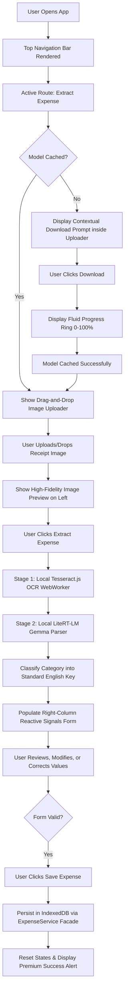

# Specification: On-Device AI Receipt Analyzer & Expense UI

**Status**: amended
**Feature Slug**: `receipt-analyzer`
**Type**: Spec / PRD

---

## 1. Product Objective

Provide a premium, 100% private, and offline-first AI receipt scanner that allows users to upload a photo of a receipt, automatically extract key transaction details locally, review and correct the extracted values, and persist them securely into their browser's IndexedDB database.

This establishes a high-fidelity "Human-In-The-Loop" correction workflow that operates entirely offline, requiring zero external server calls and keeping all user transactions strictly private.

---

## 2. User Experience Flow



---

## 3. UI Layout & Component Architecture

We adopt a split-screen desktop layout, utilizing the **Facade Pattern** to decouple the presentation layers from backend services.

### 3.1 Shared Layout Components (`src/app/shared/ui/layout/`)

- **`NavigationComponent`**: A glassmorphic top header containing routing links for `Extract Expense` (Active) and `History & Insights` (Coming Soon).
- **`FooterComponent`**: A bottom footer displaying the branding copyright and tech stack: _"2026 On-device Expense Tracker. Built with Angular, Gemma 4, Litert.js & Tailwind."_

### 3.2 Master Split-Screen Layout (`ExtractExpenseComponent`)

- **Left Column (Image Zone - Width: 40% - 50%)**:
  - **`ModelDownloader`**: Contextual panel. If the local parser is not cached, displays: _"On-Device AI Engine Offline (~50MB)"_ with a **"Download AI"** button. Once clicked, shows an active progress ring. Once finished, hides itself or shows a small green badge. Network connectivity is evaluated once on load to enable or disable the button, avoiding redundant runtime background listeners since scanning itself is 100% offline-ready.
  - **`ImageUploader`**: Hover-animated card supporting file drag-and-drop. Accepts `image/*`. Once loaded, transitions to render a full-width high-fidelity image preview (`` with fit-contain sizing).
    - **Section 3.2.1 File Size & Format Boundaries**: Enforces a strict **20MB maximum size limit** (configured as a localized constant) for dropped or selected images to prevent browser page out-of-memory thread crashes in local WebWorkers. Displays progressive loading feedback during file-reading operations (`onprogress` event bound) to ensure smooth transitions on large images and prevent visual jittering on small files.
  - **`OCR Trigger Button`**: A standalone primary button situated below the uploader card.
    - **Label**: `EXTRACT EXPENSE WITH AI`
    - **State**: Disabled by default. Enabled reactively only when the image loader emits a valid loaded image Base64 data stream.
    - **Interactions**: On click, triggers the local OCR parsing WebWorker and Gemma offline pipeline, transitioning to active loader states.

- **Right Column (Review Form - Width: 50% - 60%)**:
  - **`HumanInTheLoopForm`** (`ReviewFormComponent`): Rendered as a card with an active slate-200 border. Form inputs bind to type-safe Angular 22 Signals:
    - **Container-Aware Responsive Layout (Dynamic Padding & Stacking)**: To prevent horizontal truncation or squishing in narrow layout slots (e.g. mobile viewports or split-screen panels where width < 480px), the form card must be configured as a CSS Query Container (`form-container`). When container space is narrow:
      - The card padding must scale down from `p-7` (28px) to `p-4` (16px) to maximize editing space.
      - The split fields for Transaction Date and Amount (horizontal on desktop) must stack vertically as full-width rows.
      - The primary action buttons ("Save Expense" and "Clear Form") must stack vertically, with the primary "Save Expense" button positioned on top (using `flex-col-reverse` for optimal thumb-reach on mobile).
    - **isReceipt Warning Alert**: A conditional, slide-in warn banner displayed at the top of the form only if `isReceipt` evaluates to false. Displays: _"⚠️ This image doesn't look like a valid receipt. Fallback defaults have been loaded, but feel free to modify and save manually!"_
    - **Merchant Name**: Writable string signal. Requires length > 0.
    - **Amount**: Writable numeric signal. Must be non-null and greater than 0.
    - **Transaction Date**: Writable date-string signal (YYYY-MM-DD format).
    - **Category**: Writable string dropdown selector mapping stable English database keys to bilingual user labels:
      - `"dining"`: Dining & Meals / 餐飲
      - `"travel"`: Travel & Transport / 交通
      - `"office"`: Office & Software / 辦公
      - `"utilities"`: Utilities & Bills / 水電雜費
      - `"shopping"`: Shopping & Entertainment / 購物與娛樂
      - `"other"`: Other / 其他
  - **Action Button**: A prominent "Save Expense" primary button. Disabled if form validation fails. Clicking it invokes the `ExpenseService` to write the entry to IndexedDB, resetting the form and uploader.

- **`Parsing Retry Loop Policy`**: The parsing pipeline inside `ReceiptAnalyzerService` executes a transparent **2-attempt retry loop** around Gemma generation and JSON parsing. If the model emits a truncated block or syntax failure on attempt 1, it immediately retries once. Only if both attempts fail does the pipeline throw a user-facing error.

### 3.3 Angular Router Integration

The application uses declarative, lazy-loadable router paths in `src/app/app.routes.ts` to manage UI view state:

- **Route `/extract`**: Maps to the `ExtractExpenseComponent` (Receipt upload and human-in-the-loop review form).
- **Route `/history`**: Maps to the future `ExpenseHistoryComponent` (Paginated grid list and local insights).
- **Root Route `/`**: Auto-redirects to `/extract` to present the scan tool immediately.
- **Main Shell**: `AppComponent` acts as a thin shell holding the global `<app-navigation>` with a `<router-outlet>` immediately below it to handle route resolution dynamically.

---

## 4. Technical Architecture

We adhere strictly to our decoupled repository patterns, introducing a feature-level state coordinator and shared layout directories:

```text
src/app/
├── core/
│   ├── consts/
│   │   └── app-database.const.ts       # DB Injection Token
│   └── services/
│       ├── database.service.ts         # Low-level IndexedDB CRUD operations
│       └── ai/
│           ├── ai-model-cache.service.ts
│           └── receipt-analyzer.service.ts
├── shared/
│   └── ui/
│       ├── components/
│       │   ├── model-downloader/       # Shared Engine Progress Component
│       │   └── image-uploader/         # Shared Drag-and-Drop + Preview Component
│       └── layout/
│           ├── navigation/             # Shared Top Navigation Navbar
│           └── footer/                 # Shared Bottom Copyright Footer
└── features/
    └── expense/
        ├── services/
        │   └── expense.service.ts      # Feature Facade (Coordinates state and data flow)
        └── components/
            ├── extract-expense/        # Layout Container
            └── review-form/            # Signals-based verification Form
```

### 4.1 Feature Facade (`ExpenseService`)

- Exposes readonly signals:
  - `currentExtraction`: Holds the active `ExtractedExpense` values.
  - `isProcessing`: Boolean indicating if OCR or AI is running.
  - `modelStatus`: Mapped from `AiModelCacheService`.
- Exposes methods:
  - `downloadModel()`: Triggers model caching.
  - `extractReceipt(file: File)`: Converts image to blob, runs Tesseract + Gemma, maps the parsed result to English category keys, and sets `currentExtraction`.
  - `saveExpense(corrected: ExtractedExpense)`: Invokes `DatabaseService.insert()`, clears the state, and shows success notifications.

---

## 5. Coding Standards & Linter Constraints

- **Curly Braces**: All `if` statement blocks must be wrapped in `{}`.
- **Incrementing**: No `++` or `--`. Use `i = i + 1;` or `x = x + 1;` in logical scripts.
- **Private Encapsulation**: Private class fields must use `#` prefixes; helper methods must use standard TypeScript `private`.
- **Absolute Imports**: Always use the `@/` path alias for any files inside `src/app/`.

---

## 6. Acceptance Criteria

- [x] Workspace compiles perfectly with zero TypeScript compiler or dependency injection warnings.
- [x] Model download is strictly **user-triggered** and displays a smooth contextual progress bar.
- [x] Uploading a photo renders a high-fidelity image preview on the left.
- [x] [Decoupled] Traditional Chinese receipt text is successfully analyzed, and mapped to English category keys. (Decoupled on 2026-08-20 in favor of premium side-by-side visual manual logging).
- [x] Human-in-the-loop review form accurately reflects the extracted signals, allowing manual overrides.
- [x] Clicking "Save" persists the row into IndexedDB and resets the uploader UI gracefully.
- [x] Typography & Icons setup: Local `@fontsource` packages (`hanken-grotesk`, `inter`, `geist`, `material-symbols-outlined`) are installed and imported at the top of `src/styles.css` to enable 100% offline layout styling and iconography.

---

## 7. Amendments & Pivots

### 7.1 Decoupling of Local OCR Engine (2026-08-20)

- **Context:** Tesseract.js (the local OCR stage) exhibited poor text extraction quality on crumpled, low-contrast, or handheld receipt photos, resulting in garbled or truncated input blocks.

- **Resolution:** Decoupled the OCR engine and the "Extract Expense with AI" trigger button from the layout.
- **Resulting Architecture:** Retained the premium **Image Uploader** as a high-fidelity visual side-by-side reference card on the left panel, pairing it with a manual bilingual form on the right. This maintains visual design guidelines while delivering a fast, 100% reliable local transaction logging experience, while reserving the Gemma 4 AI engine for the **History & Insights Chat**.
