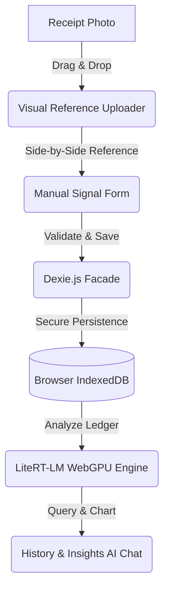

# 💸 NgOnDeviceExpenseTracker

[](https://github.com/railsstudent/ng-on-device-expense-tracker/actions/workflows/deploy.yml)
🚀 **Live App:** [https://railsstudent.github.io/ng-on-device-expense-tracker/](https://railsstudent.github.io/ng-on-device-expense-tracker/)

An ultra-private, premium, offline-first receipt manager and on-device AI transaction analyzer. This application lets you upload receipt photos for side-by-side manual input visual references, log transactions securely, and chat completely offline with local AI about your expense ledger—**ensuring 100% user data privacy with zero external server calls.**

---

## ✨ Features

- **🔒 100% Client-Side Privacy:** Your receipts, financial figures, and expense details never leave your machine.
- **🖼️ High-Fidelity Visual Reference:** Drag & drop receipt photos into a premium, responsive uploader card on the left to easily review your physical receipts side-by-side while typing details on the right.
- **🤖 Local Gemma 4 Q&A Chat:** Run Google's lightweight `gemma-4-E2B-it-litert-lm` (~2.4GB) model directly in your browser via WebGPU to query, analyze, and gain insights from your expense history.
- **📱 Container-Aware Sizing:** Fully responsive form card styled with Tailwind CSS v4 and modern **CSS Container Queries** (`@container`), adapting padding, fields, and stacking dynamically based on localized space rather than global viewports.
- **🗄️ IndexedDB Local Storage:** Fast, structured local data persistence managed by a lightweight `ExpenseService` wrapper utilizing **Dexie.js**.

---

## 🛠️ Technical Architecture & Advanced Guardrails

This application is built with modern frontend best practices and rigorous scoping constraints to survive on-device hardware limitations:



### 🧠 On-Device Hardware & Memory Constraints

- **32-bit Wasm 4GB Limit Bypass:** Standard browsers enforce a strict 32-bit **4GB RAM allocation limit** inside WebAssembly environments. Selecting the compact `Gemma 4 E2B` (~2.4GB) model instead of larger formats (`E4B`, `12B`) guarantees that active KV-caches and tokenizer processes fit safely within browser memory allocation thresholds, avoiding abrupt page crashes during chat sessions.
- **Token Optimization (Compact CSV Transmission):** Real-time records are translated to the chat model as super-compact, pipe-delimited CSV formats (`Date|Category|Merchant|Amount`). This reduces raw row weight from ~18 tokens down to only **~7 tokens per line (a 61% token saving)**, preserving valuable context space.

### 🛡️ NLP Safety Guardrails (Porter Stemmer)

- **In-House Lemmatizer & Porter Stemmer:** Chat queries are normalized and tokenized entirely offline using a first-party, strongly typed **Porter Stemmer algorithm** and irregular lemma lookup map (converting inflections like `spending`/`spent`/`spends` -> `spend` and `traveling` -> `travel`).
- **Off-Topic Prompt Blocking:** Chat inputs are evaluated against whitelisted financial stems in $O(N)$ linear time. Off-topic requests are blocked immediately before they hit the GPU, protecting local WebGPU device resources from being wasted on off-topic queries.

### ⏱️ Stable Chat Slicing Window (31-Day Boundary)

- **31-Day Search Limit:** Enforces a strict **31-day search date range filter** in the user interface. By keeping dataset payloads bound to ~30 to 120 rows, WebGPU prefill latency is guaranteed to remain **under 3 seconds** on standard consumer devices with no silent page hangs.
- **Turn-Based Auto-Reset (3-Turn Cap):** Tracks active chatTurns in memory. Once a chat session hits **3 turns**, the context is automatically cleared to stay within the model's sequence threshold.
- **Sliding 2-Question Memory:** Maintains a sliding memory of the last 2 user queries. After a session reset, these are silently injected as contextual threads, preserving natural multi-turn pronoun flow.

### 💻 Code Quality Constraints

- **Framework Architecture:** Angular 22 with modern Signal-based state, OnPush reactivity, and native **Signal Forms** (`@angular/forms/signals`).
- **State Localization:** Presentation-scoped states (sorting directions, page limits, validation states) reside locally within stateful view-service helpers rather than polluting global singletons.
- **Private Encapsulation:** Strictly enforces native JavaScript private fields (`#state`) for properties, while utilizing standard TypeScript accessors (`private`) for helper methods.

---

## 💻 Local Development & Setup

### Prerequisites

- **Node.js:** `>= 24.0.0`
- **NPM:** `>= 11.0.0`
- **WebGPU Compatible Browser:** Google Chrome (v113+), Microsoft Edge (v113+), or Safari (v18+). Ensure WebGPU flag is active if running in older browser distributions.

### Installation & Run

1. Clone the repository:

   ```bash
   git clone https://github.com/railsstudent/ng-on-device-expense-tracker.git
   cd ng-on-device-expense-tracker
   ```

2. Install dependencies:

   ```bash
   npm ci
   ```

3. Start the local development server:

   ```bash
   npm start
   ```

4. Navigate to `http://localhost:4200/` in your browser.

### Previewing the Production Build

To compile and serve the optimized, production-ready bundles locally (testing the app exactly as it renders on GitHub Pages), run:

```bash
npm run preview
```

Once started, open your browser and navigate to `http://localhost:8080/` to preview the live application build.

---

## 🧪 Testing and Quality Control

Enforces rigorous type-safety (strict ESLint configuration with no explicit `any` types) and includes unit tests for core utilities and services:

```bash
# Run unit test suite using Vitest
npm test

# Run tests once (useful for CI scripts)
npm run test:once

# Run project linting check
npm run lint
```

---

## 🚀 Deployed via GitHub Actions

This repository is configured with a modern continuous delivery pipeline in `.github/workflows/deploy.yml`. On pushing changes to your primary branch, it:

1. Downloads Node.js `24.x` and sets up global npm caching.
2. Performs a clean dependency installation (`npm ci`).
3. Builds the production Angular artifact with custom path-basing: `--base-href /ng-on-device-expense-tracker/`.
4. Creates a fallback `404.html` routing bridge to enable client-side Angular Router routing on GitHub Pages.
5. Uploads and deploys the bundle directly to GitHub Pages using the official GitHub Pages deployment APIs.
