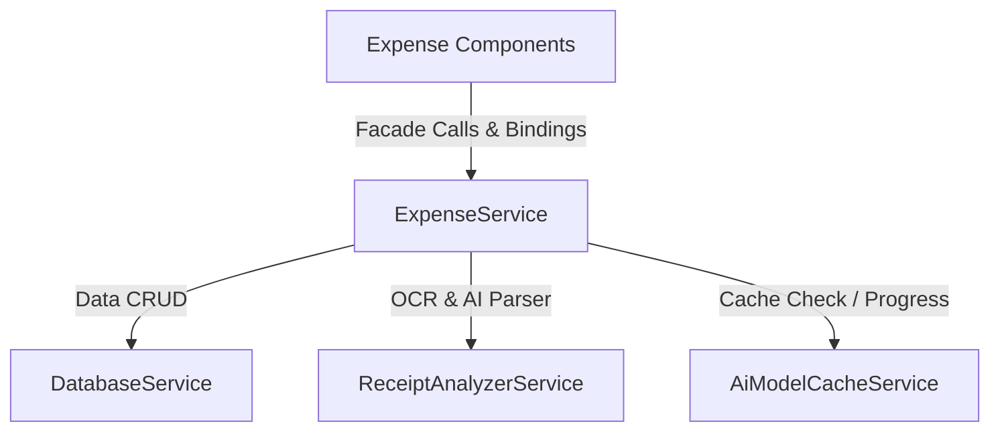

# ADR 0004: Receipt Analyzer UI and Human-In-The-Loop Form

## Status

proposed

## Context

The application contains core, fully-tested services for local OCR parsing (`ReceiptAnalyzerService`) and database operations (`DatabaseService`). We now need to build the user interface and presentation layer to let users:

1. Trigger local AI engine downloads with real-time feedback (user-initiated to save local bandwidth).
2. Upload, drop, or preview receipt images locally in high-fidelity.
3. Review and manually correct the AI-extracted metadata before persistence.
4. Persist the final corrected transaction to the local IndexedDB database.

To keep codebases maintainable, we must separate presentation logic from core logic, implement reactive state management via Angular 22 Signals, and handle localization-aware mapping (for traditional Chinese receipts classified into standard English categorization keys).

## Decision

We will build a unified expense user interface consisting of a top navigation shell and a split-screen desktop layout, mediated by a custom facade pattern:

### 1. The Facade Pattern (`ExpenseService`)

We will create a domain-specific facade service `ExpenseService` in `src/app/features/expense/services/expense.service.ts`:

- **State Management**: Holds writable signals for current extraction results (`merchantName`, `amount`, `transactionDate`, `category`), download progress, parsing state, and list of saved expenses.
- **Coordination**: Orchestrates the backend services (`AiModelCacheService`, `ReceiptAnalyzerService`, `DatabaseService`) to provide a clean, single-point-of-contact API for the UI.

### 2. Standardized Localization Categories

Traditional Chinese receipts will be processed by modifying the AI system prompt to classify transactions into a strict set of standard English keys (`dining`, `travel`, `office`, `utilities`, `shopping`, `other`). The UI will employ a `CATEGORY_MAP` dictionary to map these keys to beautiful, bilingual display names inside a human-in-the-loop dropdown:

| Key         | Localized Display Label               |
| :---------- | :------------------------------------ |
| `dining`    | Dining & Meals / 餐飲                 |
| `travel`    | Travel & Transport / 交通             |
| `office`    | Office & Software / 辦公              |
| `utilities` | Utilities & Bills / 水電雜費          |
| `shopping`  | Shopping & Entertainment / 購物與娛樂 |
| `other`     | Other / 其他                          |

### 3. Visual Layout & Component Hierarchy

- **Shared Layout Components (`src/app/shared/ui/layout/`)**:
  - **`NavigationComponent`**: A glassmorphic top header containing routing links for `Extract Expense` (Active) and `History & Insights` (Coming Soon).
  - **`FooterComponent`**: A simple, elegant sticky bottom bar displaying copyright and tech stack: _"2026 On-device Expense Tracker. Built with Angular, Gemma 4, Litert.js & Tailwind."_

- **Shared UI Components (`src/app/shared/ui/components/`)**:
  - **`ModelDownloaderComponent`**: A highly reusable card displaying local model engine status, a "Download AI" trigger, and a visual progress ring. Since any future feature requiring local AI will need model management, this component is placed in shared space.
  - **`ImageUploaderComponent`**: A highly reusable, hover-animated drag-and-drop file uploader zone that accepts image files and renders a high-fidelity local browser object URL preview (``) once loaded.
- **`ExtractExpenseComponent`**: The master feature container holding the split-screen view:
  - **Left Column (Image Zone)**:
    - Displays the shared `ModelDownloaderComponent` and `ImageUploaderComponent` inside the upload panel.
  - **Right Column (Form Review)**:
    - **`HumanInTheLoopForm`**: Interactive, responsive form using type-safe Signals. The "Save Expense" button is disabled if `merchantName` is empty, or `amount` is invalid/negative.

### 4. Angular Router Integration

To support future-proof page transitions and distinct history/insight views, we will map components to declarative, lazy-loadable router paths inside `src/app/app.routes.ts`:

- Route `/extract`: Loads the `ExtractExpenseComponent` (Receipt extraction split-view).
- Route `/history`: Loads the `ExpenseHistoryComponent` (Paginated grid & spending analytics).
- Root redirect (`/` ➔ `/extract`) ensures the user lands instantly on the tool dashboard.
- The main `AppComponent` acts as the thin shell, rendering the global `<app-navigation>` and routing views via `<router-outlet>`.

## Consequences

- **Loose Coupling**: Components will not communicate with database or AI layers directly, facilitating painless future migration if underlying storage or AI models change.
- **High Performance**: Pure signal-based change-detection minimizes zone execution overhead and creates silky-smooth animations.
- **Deterministic Testing**: Unit testing `ExpenseService` can be accomplished with simple mocks of `DatabaseService` and `ReceiptAnalyzerService`.
